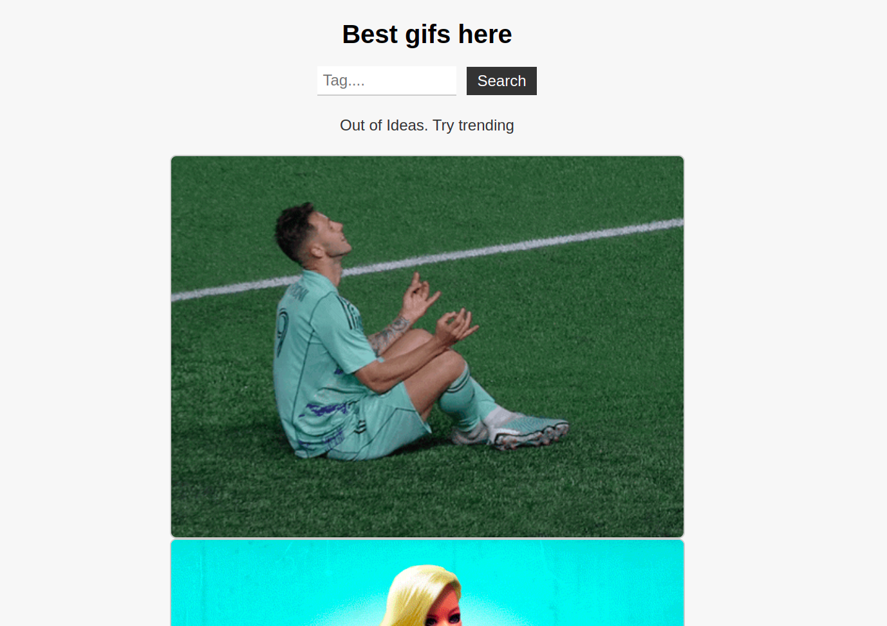

Hi, this app displays gifs. here are the instructions how to open project:

| Step | Description                                   |
|------|-----------------------------------------------|
| 1    | Clone repo                                    |
| 2    | Install composer                              |
| 3    | Change .env.example to .env // insert API KEY |
| 4    | php -S localhost:8000                         |

Wegpage screenshot:
