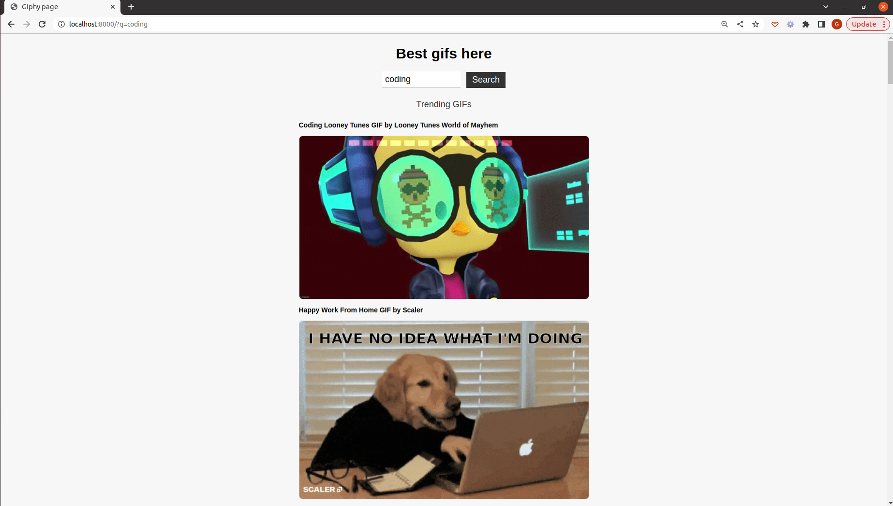

A fun application that allows users to search for and display animated GIFs using the Giphy API. Built with PHP, Twig, CSS.
Here are the instructions how to open project:

| Step | Description                                      |
|------|--------------------------------------------------|
| 1    | Clone repo                                       |
| 2    | Install composer                                 |
| 3    | Change .env.example to .env // insert API KEY    |
| 4    | run php -S localhost:8000 from /public directory |

Webpage screenshot:
